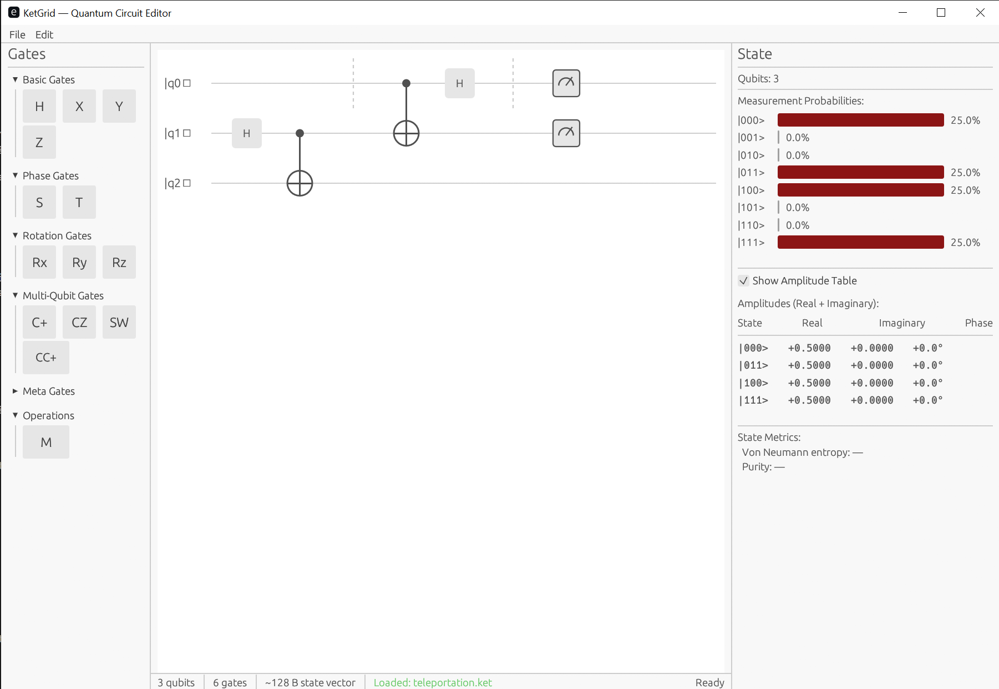

# KetGrid

**A native desktop quantum circuit editor and simulator built in Rust.**

KetGrid lets you visually build quantum circuits with drag-and-drop, simulate them locally in real time, and see results instantly — no browser, no Python environment, no cloud dependency.

[](LICENSE)
[](https://www.rust-lang.org/)
[](https://github.com/emilk/egui)

---



## Why KetGrid?

Every existing quantum circuit tool is either a static Python plot, a web app, or a terminal UI. KetGrid is the first **native GUI** approach:

| Tool | Visual Editor | Native Desktop | Open Source | Real-time Sim |
|------|:---:|:---:|:---:|:---:|
| **KetGrid** | ✅ | ✅ | ✅ | ✅ |
| Qiskit Composer | ✅ | ❌ (web) | Partial | Cloud |
| Quirk | ✅ | ❌ (web) | ✅ | ✅ (JS) |
| QPanda | ❌ | ❌ | ✅ | ✅ |

**Key advantages:**
- **Instant startup** — native binary, no runtime overhead
- **Offline** — works without internet, runs entirely on your machine
- **Real-time feedback** — simulation updates as you build, at 60fps
- **Cross-platform** — Windows, macOS, Linux from a single codebase

## Features

### What's Working Now

- **Circuit Editor** — drag-and-drop gate placement on qubit wires with visual drop indicators
- **Gate Palette** — categorized panel with all standard quantum gates (H, X, Y, Z, S, T, Rx, Ry, Rz, CNOT, CZ, SWAP, Toffoli)
- **State Vector Simulation** — custom simulator with support for all gate types including parameterized rotations
- **Probability Visualization** — phase-aware histogram with color-coded bars and toggleable amplitude table
- **Wire Management** — add, remove, rename, and reorder qubit wires
- **JSON Format** — save and load circuits as `.ket.json` files with versioning
- **Status Bar** — real-time qubit count, gate count, and memory usage estimates
- **Example Circuits** — Bell state, GHZ, Deutsch-Jozsa, teleportation, Grover (2-qubit)

### Coming Soon

See the full [Roadmap](ROADMAP.md) for details.

- Gate context menu (right-click edit/delete/copy)
- Undo/redo system
- Real-time debounced simulation on background thread
- Bloch sphere visualization
- Step-through mode with playback controls
- Entanglement visualization
- OpenQASM & Qiskit export/import
- SVG/PNG circuit export
- Keyboard shortcuts

### Future Directions

Post-v1.0, we're considering a **quantum kernel emulator** approach that would model quantum phenomena more faithfully — showing 1-to-n qubit relationships and probabilistic measurement collapse in a visceral way. See the [Roadmap](ROADMAP.md) for details.

## Getting Started

### Prerequisites

- [Rust](https://rustup.rs/) (edition 2024)
- A C/C++ linker (comes with Visual Studio Build Tools on Windows, Xcode on macOS, `build-essential` on Linux)

### Build from Source

```bash
git clone https://github.com/OlaProeis/KetGrid.git
cd KetGrid
cargo build --release
```

### Run

```bash
cargo run --release -p ketgrid-gui
```

Or run the built binary directly:

```bash
# Windows
target/release/ketgrid.exe

# macOS / Linux
target/release/ketgrid
```

### Load an Example Circuit

Example circuits are in the `examples/` directory:

```
examples/
├── bell.ket.json           # Bell state (|Φ+⟩)
├── ghz.ket.json            # GHZ state (3-qubit entanglement)
├── deutsch-jozsa.ket.json  # Deutsch-Jozsa algorithm
├── teleportation.ket.json  # Quantum teleportation
└── grover-2qubit.ket.json  # Grover's search (2-qubit)
```

## Architecture

KetGrid uses a Cargo workspace with three crates, keeping concerns cleanly separated:

```
crates/
├── ketgrid-core/   # Circuit data model, gate definitions, serialization
├── ketgrid-sim/    # State vector simulation engine
└── ketgrid-gui/    # egui application (renderer, editor, palette, visualizations)
```

- **ketgrid-core** can be used as a standalone library for other Rust quantum projects
- **ketgrid-sim** can be swapped or extended independently (GPU backend planned)
- **ketgrid-gui** provides the visual interface without polluting the core/sim crates with GUI dependencies

### Tech Stack

| Component | Technology |
|-----------|-----------|
| Language | Rust |
| GUI | egui + eframe |
| Math | nalgebra (complex matrix ops) |
| Serialization | serde + serde_json |
| Persistence | dirs (cross-platform paths) |

## Circuit File Format

KetGrid uses a JSON-based `.ket.json` format:

```json
{
  "ket_version": "0.1.0",
  "name": "Bell State",
  "description": "Creates an entangled Bell state |Φ+⟩",
  "qubits": 2,
  "gates": [
    { "type": "H", "targets": [0], "column": 0 },
    { "type": "CNOT", "controls": [0], "targets": [1], "column": 1 }
  ],
  "measurements": [
    { "qubit": 0, "column": 2 },
    { "qubit": 1, "column": 2 }
  ]
}
```

## Target Users

- **Students** — visual feedback makes quantum concepts tangible
- **Researchers** — faster prototyping than writing Python scripts
- **Educators** — live demos and step-through mode for teaching
- **Developers** — bridge from classical to quantum thinking

## Performance Targets

| Metric | Target |
|--------|--------|
| Startup time | < 500ms |
| Gate placement feedback | < 16ms (60fps) |
| Simulation (≤15 qubits) | < 100ms |
| Simulation (≤25 qubits) | < 5s (background) |
| Memory (idle) | < 30MB |
| Binary size | < 20MB |

## Contributing

Contributions are welcome! Here's how to get started:

1. Fork the repository
2. Create a feature branch (`git checkout -b feature/my-feature`)
3. Make your changes and ensure they compile (`cargo check --workspace`)
4. Run tests (`cargo test --workspace`)
5. Commit with a descriptive message
6. Open a Pull Request

Please see the [Roadmap](ROADMAP.md) for planned features and areas where help is needed.

### Development Setup

```bash
# Clone the repo
git clone https://github.com/OlaProeis/KetGrid.git
cd KetGrid

# Check everything compiles
cargo check --workspace

# Run tests
cargo test --workspace

# Run the app in development mode
cargo run -p ketgrid-gui
```

### Project Structure for Contributors

| Want to... | Look in... |
|---|---|
| Define gate types / circuit model | `crates/ketgrid-core/src/` |
| Run simulation | `crates/ketgrid-sim/src/` |
| Render circuit visually | `crates/ketgrid-gui/src/circuit_view.rs` |
| Handle drag-and-drop | `crates/ketgrid-gui/src/editor.rs` |
| Manage gate palette UI | `crates/ketgrid-gui/src/gate_palette.rs` |
| Visualize state/probabilities | `crates/ketgrid-gui/src/state_view.rs` |
| Load/save JSON circuits | `crates/ketgrid-core/src/format/` |
| Example circuits | `examples/` |

## Documentation

Technical documentation lives in `docs/`:

- [Project Scaffolding](docs/project-scaffolding.md) — workspace structure and crate organization
- [Circuit Data Model](docs/circuit-data-model.md) — core data structures
- [Wire Management](docs/wire-management.md) — qubit wire lifecycle
- [Gate Matrices](docs/gate-matrices.md) — unitary matrix representations
- [State Vector Simulator](docs/state-vector-simulator.md) — simulation engine internals
- [Circuit Renderer](docs/circuit-renderer.md) — visualization and layout
- [State Visualization](docs/state-visualization.md) — probability histograms and amplitude tables
- [Status Bar](docs/status-bar.md) — real-time circuit metrics
- [Gate Palette](docs/gate-palette.md) — gate selection panel
- [Example Circuits](docs/example-circuits.md) — built-in examples
- [Drag-and-Drop Placement](docs/drag-and-drop-placement.md) — editor interaction model

## License

KetGrid is licensed under the [MIT License](LICENSE).

## AI Disclaimer

This project is coded entirely by AI. All source code, documentation, architecture decisions, and test cases were generated through AI-assisted development using large language models. A human provides the direction, requirements, and review — the AI writes the code.

This is an experiment in AI-driven software development as much as it is a quantum circuit tool. If you find bugs, rough edges, or questionable patterns — that's part of the journey. Contributions and feedback from humans are very welcome.

## Acknowledgments

- [egui](https://github.com/emilk/egui) — immediate-mode GUI library for Rust
- [nalgebra](https://nalgebra.org/) — linear algebra for Rust
- [Nielsen & Chuang](https://en.wikipedia.org/wiki/Quantum_Computation_and_Quantum_Information) — standard quantum circuit notation conventions
