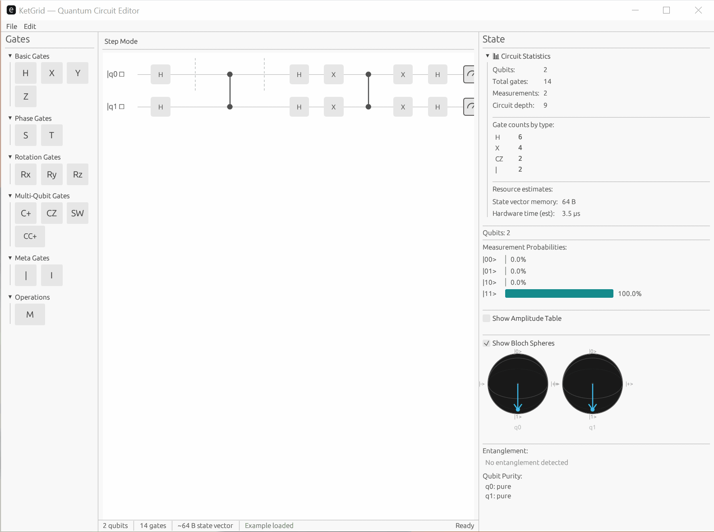

# KetGrid

**A native desktop quantum circuit editor and simulator built in Rust.**

KetGrid lets you visually build quantum circuits with drag-and-drop, simulate them locally in real time, and see results instantly — no browser, no Python environment, no cloud dependency.

[](LICENSE)
[](https://www.rust-lang.org/)
[](https://github.com/emilk/egui)

---



## Why KetGrid?

Every existing quantum circuit tool is either a static Python plot, a web app, or a terminal UI. KetGrid is the first **native GUI** approach:

| Tool | Visual Editor | Native Desktop | Open Source | Real-time Sim |
|------|:---:|:---:|:---:|:---:|
| **KetGrid** | ✅ | ✅ | ✅ | ✅ |
| Qiskit Composer | ✅ | ❌ (web) | Partial | Cloud |
| Quirk | ✅ | ❌ (web) | ✅ | ✅ (JS) |
| QPanda | ❌ | ❌ | ✅ | ✅ |

**Key advantages:**
- **Instant startup** — native binary, no runtime overhead
- **Offline** — works without internet, runs entirely on your machine
- **Real-time feedback** — simulation updates as you build, at 60fps
- **Cross-platform** — Windows, macOS, Linux from a single codebase

## Features

### Circuit Editor
- **Drag-and-drop** gate placement on qubit wires with visual drop indicators
- **Gate palette** with collapsible categories: Basic (H, X, Y, Z), Phase (S, T), Rotation (Rx, Ry, Rz), Multi-Qubit (CNOT, CZ, SWAP, Toffoli), Measurement
- **Right-click context menu** for editing gate parameters, copy, paste, and delete
- **Wire management** — add, remove, rename, and reorder qubit wires
- **Undo/redo** — operation-based history with Ctrl+Z / Ctrl+Y (100 operations deep)
- **Keyboard shortcuts** — Delete, Ctrl+C/V, wire management hotkeys

### Simulation
- **Real-time state vector simulation** with 100ms debounced updates on a background thread
- **Step-through mode** — advance one gate column at a time with playback controls (step, play, reset)
- **Incremental re-simulation** — only recomputes from the modified column forward
- **Gate fusion** — consecutive single-qubit gates on the same qubit composed into a single matrix
- **Rayon parallelism** — automatic parallelization for ≥12 qubit circuits

### Visualization
- **Probability histogram** with phase-aware coloring and toggleable amplitude table
- **Bloch sphere** — per-qubit 2D-projected Bloch sphere using reduced density matrix
- **Entanglement visualization** — color-coded qubit wires showing entanglement groups
- **Circuit statistics** — gate counts by type, circuit depth, qubit usage, memory and hardware time estimates
- **Status bar** — real-time qubit count, gate count, and memory usage

### Export & Import
- **OpenQASM 2.0 export** — standard quantum assembly format
- **OpenQASM 2.0 import** — parse QASM files with full gate mapping and ASAP scheduling
- **Qiskit Python export** — generate importable `QuantumCircuit` code
- **SVG export** — publication-quality vector circuit diagrams
- **JSON format** — native `.ket.json` save/load with versioned schema

### Example Library
- **21 built-in circuits** organized by category with searchable browser
- **Fundamentals**: Bell state, Hadamard, Pauli gates, Phase gate, T gate, Rotations, SWAP, Toffoli
- **Algorithms**: Deutsch-Jozsa, Bernstein-Vazirani, Simon's, Grover (2-qubit), QFT (3-qubit), Superdense coding, Teleportation
- **Error Correction**: Bit-flip code, Phase-flip code, Shor code

### Future Directions

See the full [Roadmap](ROADMAP.md) for detailed technical plans. The three major post-v0.1.0 workstreams are:

1. **GPU Acceleration via wgpu** — Push from ~14 qubits to 25+ using wgpu compute shaders with cross-platform support (Windows DX12, macOS Metal, Linux Vulkan)
2. **Quantum Phenomena Visualization** — Visceral animations showing amplitude flow, measurement collapse, and entanglement propagation in real-time
3. **True Quantum Emulator** — Shots-based simulation, Black Box mode, correlation discovery, and interactive Bell inequality experiments

Additional planned features include noise simulation, parameterized circuits with sliders, custom gate definitions, tutorial mode, and a WASM web target.

## Download

Pre-built binaries are available on the [Releases](https://github.com/OlaProeis/KetGrid/releases) page for:
- **Windows** (x86_64)
- **macOS** (Apple Silicon and Intel)
- **Linux** (x86_64)

## Build from Source

### Prerequisites

- [Rust](https://rustup.rs/) (edition 2024)
- A C/C++ linker (comes with Visual Studio Build Tools on Windows, Xcode on macOS, `build-essential` on Linux)
- Linux only: `libxcb-render0-dev libxcb-shape0-dev libxcb-xfixes0-dev libxkbcommon-dev libssl-dev libgtk-3-dev`

### Build & Run

```bash
git clone https://github.com/OlaProeis/KetGrid.git
cd KetGrid
cargo build --release
cargo run --release -p ketgrid-gui
```

Or run the built binary directly:

```bash
# Windows
target/release/ketgrid.exe

# macOS / Linux
target/release/ketgrid
```

## Architecture

KetGrid uses a Cargo workspace with three crates, keeping concerns cleanly separated:

```
crates/
├── ketgrid-core/   # Circuit data model, gate definitions, serialization, import/export
├── ketgrid-sim/    # State vector simulation engine
└── ketgrid-gui/    # egui application (renderer, editor, palette, visualizations)
```

- **ketgrid-core** can be used as a standalone library for other Rust quantum projects
- **ketgrid-sim** can be swapped or extended independently (GPU backend planned)
- **ketgrid-gui** provides the visual interface without polluting the core/sim crates with GUI dependencies

### Tech Stack

| Component | Technology |
|-----------|-----------|
| Language | Rust |
| GUI | egui + eframe |
| Math | nalgebra (complex matrix ops) |
| Parallelism | rayon |
| Serialization | serde + serde_json |
| Parsing | nom (OpenQASM import) |
| Persistence | dirs (cross-platform paths) |

## Circuit File Format

KetGrid uses a JSON-based `.ket.json` format:

```json
{
  "ket_version": "0.1.0",
  "name": "Bell State",
  "description": "Creates an entangled Bell state |Φ+⟩",
  "qubits": 2,
  "gates": [
    { "type": "H", "targets": [0], "column": 0 },
    { "type": "CNOT", "controls": [0], "targets": [1], "column": 1 }
  ],
  "measurements": [
    { "qubit": 0, "column": 2 },
    { "qubit": 1, "column": 2 }
  ]
}
```

## Target Users

- **Students** — visual feedback makes quantum concepts tangible
- **Researchers** — faster prototyping than writing Python scripts
- **Educators** — live demos and step-through mode for teaching
- **Developers** — bridge from classical to quantum thinking

## Performance Targets

| Metric | Target |
|--------|--------|
| Startup time | < 500ms |
| Gate placement feedback | < 16ms (60fps) |
| Simulation (≤15 qubits) | < 100ms |
| Simulation (≤25 qubits) | < 5s (background) |
| Memory (idle) | < 30MB |
| Binary size | < 20MB |

## Contributing

Contributions are welcome! Here's how to get started:

1. Fork the repository
2. Create a feature branch (`git checkout -b feature/my-feature`)
3. Make your changes and ensure they compile (`cargo check --workspace`)
4. Run tests (`cargo test --workspace`)
5. Commit with a descriptive message
6. Open a Pull Request

Please see the [Roadmap](ROADMAP.md) for planned features and areas where help is needed.

### Development Setup

```bash
git clone https://github.com/OlaProeis/KetGrid.git
cd KetGrid
cargo check --workspace
cargo test --workspace
cargo run -p ketgrid-gui
```

### Project Structure for Contributors

| Want to... | Look in... |
|---|---|
| Define gate types / circuit model | `crates/ketgrid-core/src/` |
| Run simulation | `crates/ketgrid-sim/src/` |
| Render circuit visually | `crates/ketgrid-gui/src/circuit_view.rs` |
| Handle drag-and-drop | `crates/ketgrid-gui/src/editor.rs` |
| Manage gate palette UI | `crates/ketgrid-gui/src/gate_palette.rs` |
| Visualize state/probabilities | `crates/ketgrid-gui/src/state_view.rs` |
| Load/save JSON circuits | `crates/ketgrid-core/src/format/` |
| Import/export (QASM, Qiskit, SVG) | `crates/ketgrid-core/src/format/` |
| Example circuits | `examples/` |
| Browse/load examples | `crates/ketgrid-gui/src/examples.rs` |

## Documentation

Technical documentation lives in `docs/`:

- [Project Scaffolding](docs/project-scaffolding.md) — workspace structure and crate organization
- [Circuit Data Model](docs/circuit-data-model.md) — core data structures
- [Wire Management](docs/wire-management.md) — qubit wire lifecycle
- [Gate Matrices](docs/gate-matrices.md) — unitary matrix representations
- [State Vector Simulator](docs/state-vector-simulator.md) — simulation engine internals
- [Circuit Renderer](docs/circuit-renderer.md) — visualization and layout
- [State Visualization](docs/state-visualization.md) — probability histograms and amplitude tables
- [Status Bar](docs/status-bar.md) — real-time circuit metrics
- [Gate Palette](docs/gate-palette.md) — gate selection panel
- [Example Circuits](docs/example-circuits.md) — built-in examples
- [Drag-and-Drop Placement](docs/drag-and-drop-placement.md) — editor interaction model
- [Gate Context Menu](docs/gate-context-menu.md) — right-click operations
- [Undo/Redo](docs/undo-redo.md) — operation-based edit history
- [Debounced Simulation](docs/debounced-simulation.md) — background sim with dirty-column tracking
- [Bloch Sphere](docs/bloch-sphere.md) — per-qubit Bloch sphere visualization
- [Step-Through Mode](docs/step-through-mode.md) — single-gate stepping and playback
- [Entanglement Visualization](docs/entanglement-visualization.md) — color-coded entanglement clusters
- [Circuit Statistics](docs/circuit-statistics.md) — detailed circuit metrics panel
- [OpenQASM Export](docs/openqasm-export.md) — QASM 2.0 export format
- [OpenQASM Import](docs/openqasm-import.md) — QASM 2.0 parser and import
- [Qiskit Export](docs/qiskit-export.md) — Qiskit Python code generation
- [SVG Export](docs/svg-export.md) — vector circuit diagram export
- [Example Library Browser](docs/example-library-browser.md) — categorized example browser UI
- [Keyboard Shortcuts](docs/keyboard-shortcuts.md) — complete shortcut reference

## License

KetGrid is licensed under the [MIT License](LICENSE).

## AI Disclaimer

This project is coded entirely by AI. All source code, documentation, architecture decisions, and test cases were generated through AI-assisted development using large language models. A human provides the direction, requirements, and review — the AI writes the code.

This is an experiment in AI-driven software development as much as it is a quantum circuit tool. If you find bugs, rough edges, or questionable patterns — that's part of the journey. Contributions and feedback from humans are very welcome.

## Acknowledgments

- [egui](https://github.com/emilk/egui) — immediate-mode GUI library for Rust
- [nalgebra](https://nalgebra.org/) — linear algebra for Rust
- [Nielsen & Chuang](https://en.wikipedia.org/wiki/Quantum_Computation_and_Quantum_Information) — standard quantum circuit notation conventions
